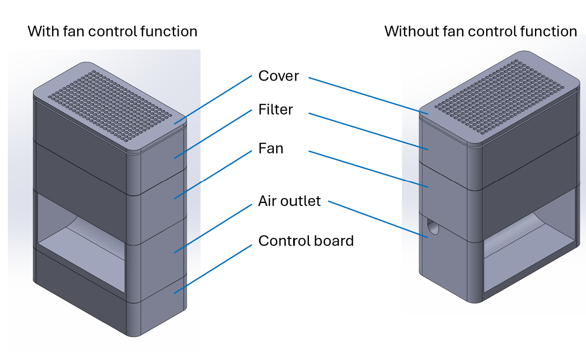
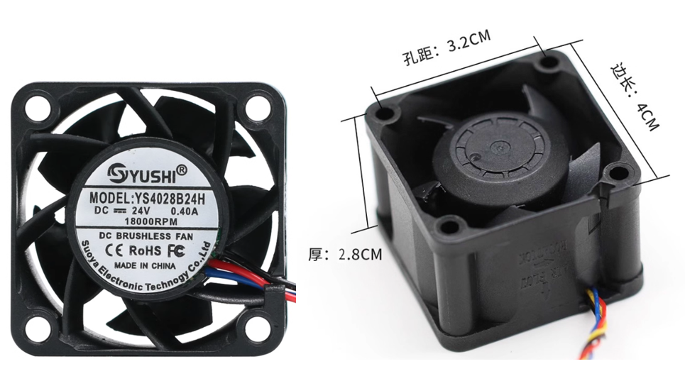
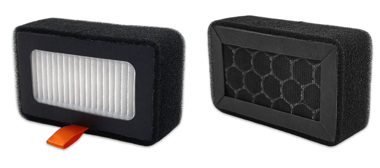
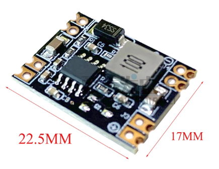
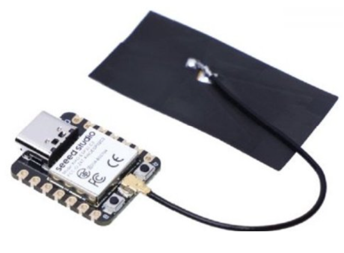
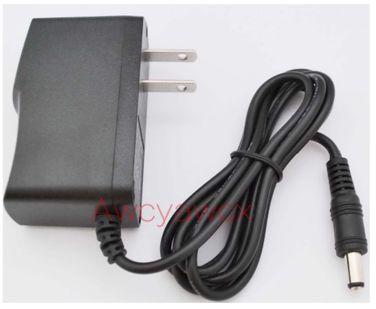
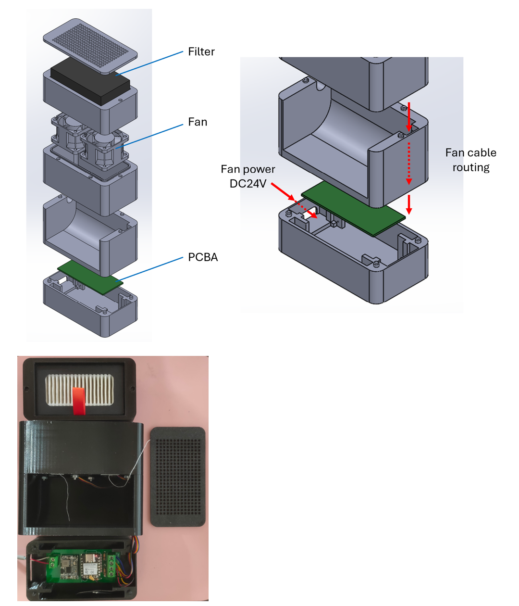
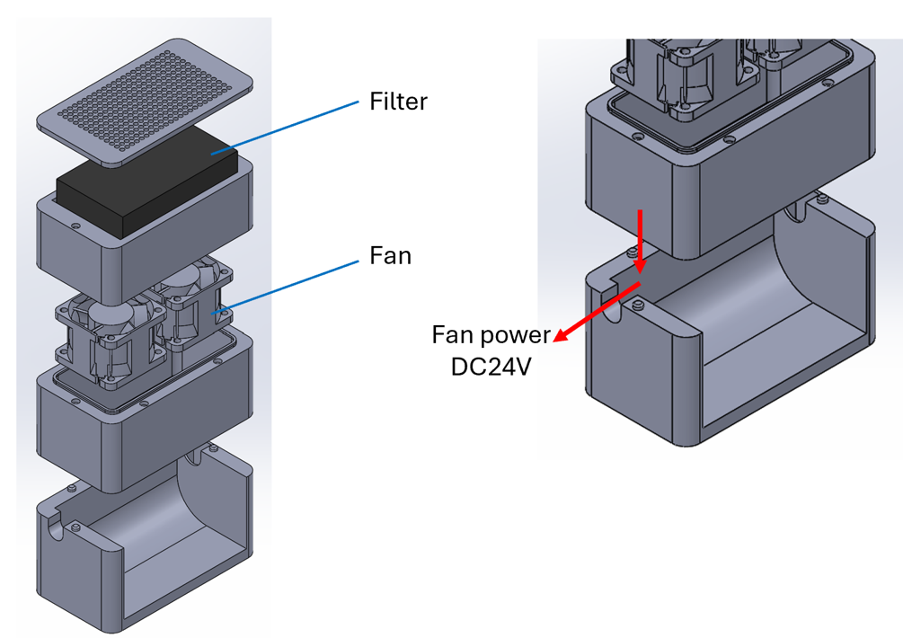
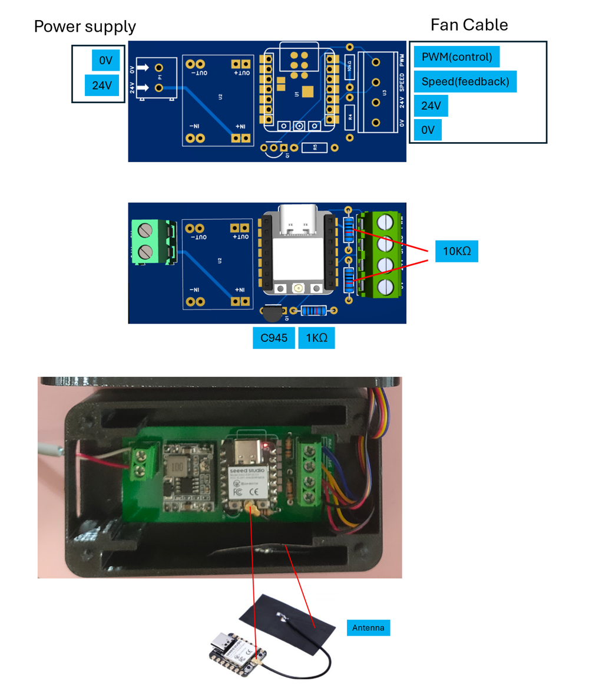
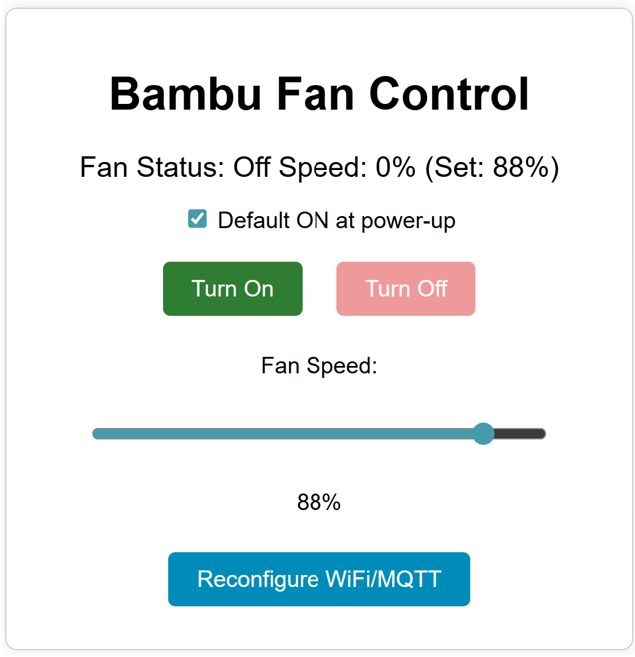

# Air Filtration System – User Guide

## Table of Contents
- [Introduction](#introduction)  
- [Description](#description)  
  - [1. 3D Printing and Fan](#1-3d-printing-and-fan)  
    - [1.1 Printed Parts](#11-printed-parts)  
    - [1.2 Standard Components](#12-standard-components)  
    - [1.3 Key Components](#13-key-components)  
    - [1.4 Assembly](#14-assembly)  
  - [2. Fan Control Board](#2-fan-control-board)  
    - [2.1 PCB Layout](#21-pcb-layout)  
  - [3. ESP32 Firmware](#3-esp32-firmware)  
  - [4. Control Board Configuration and Operation](#4-control-board-configuration-and-operation)  
    - [4.1 Initial Configuration](#41-initial-configuration)  
      - [4.1.1 Accessing the Configuration Page](#411-accessing-the-configuration-page)  
      - [4.1.2 Wi-Fi Configuration](#412-wi-fi-configuration)  
      - [4.1.3 Configuration Parameters](#413-configuration-parameters)  
    - [4.2 Operation](#42-operation)  
      - [4.2.1 Web Interface](#421-web-interface)  
      - [4.2.2 Web API](#422-web-api)  
      - [4.2.3 MQTT Commands](#423-mqtt-commands)  
      - [4.2.4 Re-Configuration](#424-re-configuration)

---

## Introduction
Upgrade your **Bambu S1P** or **X1C 3D printer** with a smarter way to breathe clean air.  
This modular air filtration system features a **2-in-1 HEPA13 + activated carbon filter**, effectively removing fine particles and odors.  
Its modular structure allows for quick and easy filter replacement.

Unlike conventional filters, this system supports **intelligent fan control**.  
Connect to **Wi-Fi** to manage the fan remotely — turn it on/off, adjust speed, or monitor real-time status via:

- Built-in **Web UI**
- **RESTful Web API**
- **MQTT protocol** for automation
- Full integration with **Home Assistant**

This project is **fully open-source** and divided into three modular parts:

1. 3D-Printed Housing and Fan  
2. Fan Control Board  
3. ESP32 Firmware

---

## Description

### 1. 3D Printing and Fan

#### 1.1 Printed Parts
A total of **five 3D-printed components** are required.  
All 3D models are published on **MakerWorld** & **Github** — feel free to download and print them.  
If you do not require the fan-control function, you may omit printing the control-board enclosure.



---

#### 1.2 Standard Components

| Item | Spec. / Model | Qty. | Note |
|:---|:---|:---:|:---|
| 1. Fan | 4028 DC 24 V / 4 wire, 18000 rpm | 2 | 1. 2-wire model optional   2. RPM lower than 18000 is fine. |
| 1.1 Screw | M3 × 35 mm | 8 (4) | 2 screws per fan are acceptable |
| 1.2 Nut | M3 | 8 (4) | — |
| 2. Filter | HEPA13 + Activated Carbon Air Filter | 1 | — |
| 3. PCB Board | Ref. Gerber file | 1 | — |
| 3.1 ESP32 | Seeed Studio XIAO ESP32-C3 | 1 | With external antenna |
| 3.2 DC-DC Regulator | MP1584EN DC-DC Regulator | 1 | Input 24 V, Output 5 V |
| 3.3 Terminal | 5.08 mm × 2 P | 3 | — |
| 3.4 IC Socket | 2.54 mm × 7 P | 2 | Optional |
| 3.5 Transistor | C945 (TO-92) | 1 | — |
| 3.6 Resistor | 10 kΩ 1/4 W | 2 | — |
| 3.7 Resistor | 1 kΩ 1/4 W | 1 | — |
| 4. Power Adaptor | Output DC 24 V 1 A | 1 | — |

---

#### 1.3 Key Components
- **Fan** – 4-wire model (2-wire optional)  
  [Where to buy?](https://detail.tmall.com/item.htm?_u=427molsp02c1&id=695868124936&pisk=gC7_Gc4xMADsHMIJfEPEA6L3RJ8fhWzzkjOAZs3ZMFL9cqCNFIu20lAjlp18sdr0jtsCH9xwBK-2lI6yK1u4s1PblsCJBESwQIBFh9mNQZJVLr1lFhuNMZlGxT5-7NrMuqTMoEezUzzP_1YDkBZicxniJQRbuCKYYen6Q1Z8UzzPOldMu6ePuzm5ZZArkEK9DynpKIMxkcBvvedXpVdxWIHLOIvpkC3962ppGQhtWcBxvydy6mHvXndLJIdykKBvXvFBipd9kEBA9WOmBIEB9l9F17BBpTE822mvKq3ARCtL41pLS_QH1Qv566MrUSA6fLC9dRHsHcxdin_miqtV6gXDwOHThKbC9NIReJowBgOfai68gcAecNYBHNUoNpQ1GwtGYAn9NF962NKsa7fMDM_B7Nemq65BB3TFYk2w0F61qLxTxJXfOdWA5HH_LKSPTNKCeJuCnnsA7eQTpzsPF4J7A9mjO30XOLPQOmmm6Q7Yeu-UABx9tBczOWirmhdHOLPQOmmDXBA3zWNI4mf..&spm=a1z09.2.0.0.79402e8dttF23n)
  

- **Filter** – HEPA13 + Carbon  
  [Where to buy?](https://item.taobao.com/item.htm?_u=427molsp69b8&id=895551373211&pisk=goF_GX1vkhxsZSw-Cj7edyhhOMlbhw5PMEgYrrdwkfhthIUaVqRq3O0XGDaRScWcIowQDkDZXmkqGqZrxPRVSP7fGrU-XjyZbqEUckvabSo4YsauVARakS8gKuzJ_5WigIGiijIP4_5z7PcmM26MhnKiJV0lgC3xWfcp4cTNe_5zSyTZWazdaSls0QgHHIExBvCKPD39DmpORX3ZljdtHCppvD0xMjH96BdKkqRvWcpORe3ZPdptBcKKvqgjWjhYDpQIoD3tMjEYJwgmaxWIJOiU5aEIvuBRwfUtAIdY61DsVu92GIwtWAa8ADaU8WgsC0HYvk136kzY_5DhKpl088ZbHuIeQceSPkMzCgO_Vl0YAfPRoODnHSNj-JjXh0wY782xdNCTRfisHWrpzpc_HlVjIRTcryhTx8moB9jnR5Prh0DBvGUURcH7hlSHMcy7JkMzTHRrw8qQGYhR4LOrV9ZHheMkG2iPRw9DnF3zMgBrL9gnB20Hzw_BUKDt-2iPRw9DnA3n-_7CRLJc.&skuId=5747471645091&spm=a1z09.2.0.0.79402e8dttF23n)
  

- **DC-DC Regulator** – MP1584EN   
  [Where to buy?](https://item.taobao.com/item.htm?_u=427molspbbf8&id=662919695159&pisk=gMKTG6VblXciWaFaBI0nm3Kc6wMHB2vwLCJ7msfglBdpMLeMSZfclidywZZm7GbADB1Hj1vGft_XiQTG1Ff0Dnde6lqcfImAGL8E31XMj-BXRCEDSdfMJ-IwxFqcsfSvhQjxZbmoqdJNuiGoZweZSvs5era_iNZCRiXv-dagFdJN0sw3G4YBQ-Fq6_G1hsMdAtBTli__c9NCTt41GI11RW6RUi1XGIsQOTX8ft1b56iCTT4fhP_sAy6GeOa_5I9Ipt5CGi_6GpMd361jQMqOMR1zDFNXCtiTmk_lPHBOW_9K8oZYw9FlOd9LDoQLmN1Sq6EbcHB9HQU8Yu3cNU5Gr_RIxlIvdtddrFh8XIpXUE_pD5MMNKOwvGS-oA7JReYlWeh_D6xGHasfJ-ZXpMCewHjSVWBeRdYXbCeYcO-MqZCPJxZVoMtlPUOT3YJCftOVznczb19XU38l2cFPBe9Rvgzvq3e427fRnPMKprzV59zdTotmAC50g9CoLBz4uwBFp_DKprzV59WdZv7Uur7dL&spm=a1z09.2.0.0.79402e8dttF23n)
  

- **Seeed Studio XIAO ESP32-C3**   
  [Where to buy?](https://item.taobao.com/item.htm?abbucket=6&id=679197017494&mi_id=0000IQ1VLIBlNmSKT31Enp1X5ZbMc2NrLxxhFKzKXM-Z-GY&ns=1&priceTId=2100c80217595572791575080e0990&skuId=4870061152639&spm=a21n57.1.hoverItem.1&utparam=%7B%22aplus_abtest%22%3A%22fc1e52148c64120197ae91159d3bb6dd%22%7D&xxc=taobaoSearch)
  

- **Power Adapter** (DC 24 V)  
  

---

#### 1.4 Assembly

##### 1.4.1 With Fan Control Function
Install the control board, connect the ESP32, and wire the fan’s PWM control line according to the circuit layout.



##### 1.4.2 Without Fan Control Function
Connect the fan directly to a **DC 24 V power source** for constant operation.



---

### 2. Fan Control Board

#### 2.1 PCB Layout (70.6 × 31.8 mm)
You may either:

- Solder an **IC socket** to the PCB and insert the ESP32 module, or  
- Solder the **ESP32 directly** to the board for **ease of assembly**.  
[Gerber file](https://github.com/williamautostudio/BambuFilter/tree/main/pcba)


---

### 3. ESP32 Firmware
Source code is available on [**GitHub**.](https://github.com/williamautostudio/BambuFilter/tree/main/firmware)

To build and upload the firmware:
1. Use **VS Code** with **PlatformIO**.  
2. Follow online tutorials for compiling and flashing if unfamiliar (not covered in this document).

---

### 4. Control Board Configuration and Operation

#### 4.1 Initial Configuration
Upon first power-up, the **ESP32** runs in **AP mode**.  
You can connect via browser to configure Wi-Fi and default fan settings.  

If configuration is skipped, the fan runs with **factory defaults**:
- Default speed : 50 %
- Fan auto-starts after power-on

---

##### 4.1.1 Accessing the Configuration Page
1. Power on the ESP32 —it starts in AP mode with SSID `BambuFanAP`.  
2. Connect your computer or phone to `BambuFanAP`.  
3. Open browser → `http://192.168.4.1` to access the configuration interface.

---

##### 4.1.2 Wi-Fi Configuration
Click **“Configure Wi-Fi”** to open the setup page.

> ⚠️ If the SSID disconnects, reconnect to `BambuFanAP`.  
> The ESP32’s web server may respond slowly — please wait rather than clicking repeatedly.  
> If no response within 3 minutes, **power-cycle** the device and retry.

---

##### 4.1.3 Configuration Parameters
- **Wi-Fi Settings** — SSID and Password  
- **Fan Default Speed** — 15 %–100 % (default 50 %)  
- **Fan Default ON** — whether fan turns on automatically after power-on  
  - `True` = ON by default  
  - `False` = manual activation via Web API / MQTT / Web UI  
- Click **Save** to store settings.

---

#### 4.2 Operation

##### 4.2.1 Web Interface
- **Default ON at Power-Up** – Defines auto-start behavior.  
- **Turn On / Turn Off** – Manual fan control; speed retains last setting.  
- **Fan Speed** – Adjust 15 %–100 %. Below 15 % auto-corrects to 15 %.  
  - If below 25 %, starts at 25 % briefly for stable startup.



---

##### 4.2.2 Web API
Assuming ESP32 IP = `192.168.1.2`:

| Function | Endpoint |
|:---|:---|
| Enable Default ON | `http://192.168.1.2/fan?default_on=true` |
| Disable Default ON | `http://192.168.1.2/fan?default_on=false` |
| Turn On Fan | `http://192.168.1.2/fan?state=on` |
| Turn Off Fan | `http://192.168.1.2/fan?state=off` |
| Set Fan Speed 70 % | `http://192.168.1.2/fan?speed=70` |

---

##### 4.2.3 MQTT Commands
- **Default Topic:** `bambu/p1s/fan/cmd`  
- **Payload Format:** Raw numeric value  

**Examples:**
```text
Set speed 70 % → cmd = 70  
Stop fan → cmd = 0
```

---

##### 4.2.4 Re-Configuration
Click **“Reconfigure Wi-Fi / MQTT”** to update settings without rebooting.  

> ⚠️ Note: Each time you enter the configuration page, re-enter Wi-Fi SSID and password.

---

✅ **End of Document**
