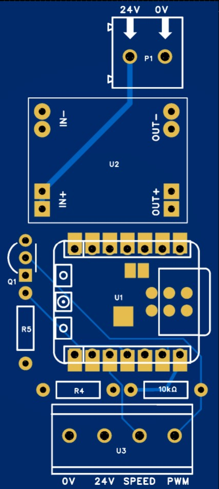
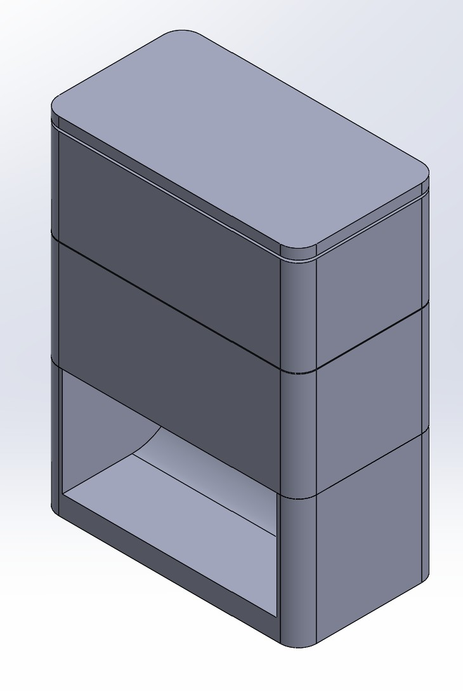
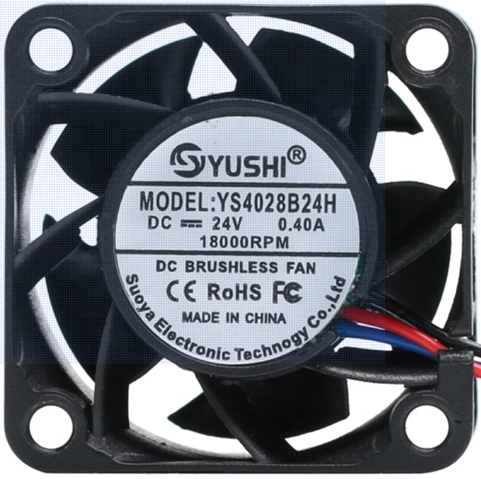
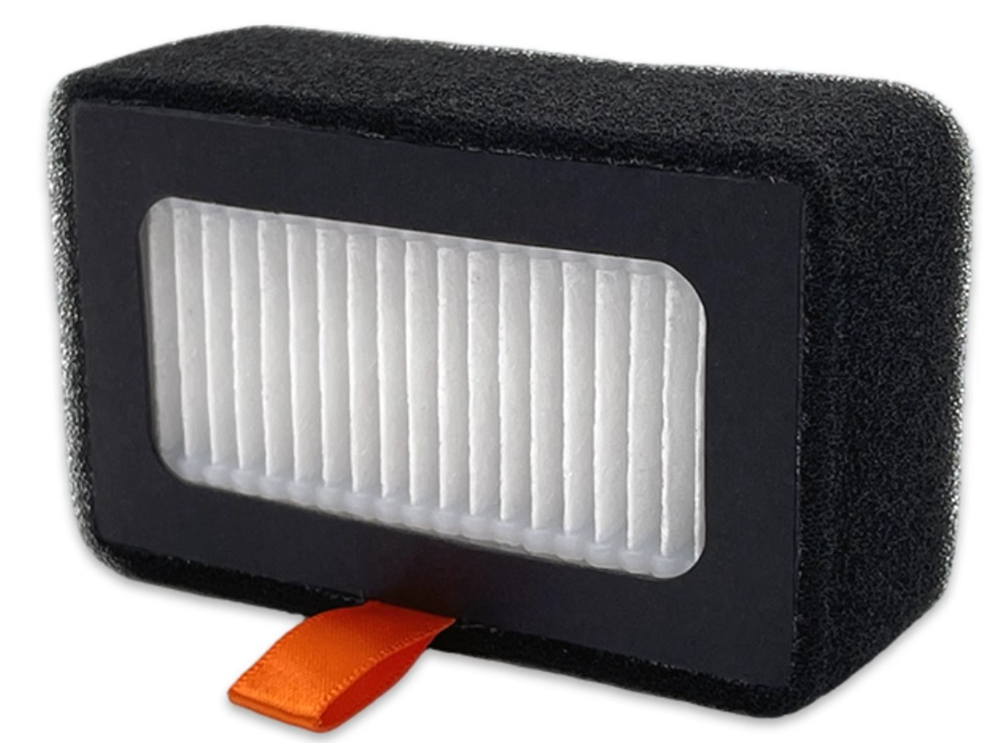

# Bambu P1S Fan Control (ESP32C3)

This project provides firmware for a Seeed XIAO ESP32C3 microcontroller to control a 4-wire PWM fan, specifically designed for use with the Bambu Lab P1S. It connects to WiFi, uses MQTT for communication, and supports Over-The-Air (OTA) updates.

## Features

*   **WiFi Connectivity**: Connects to your local WiFi network, configurable via a web portal if no network is found or if re-configured.
*   **MQTT Control**: Remotely control fan speed via MQTT messages (bidirectional communication).
*   **4-wire PWM Fan Control**: Accurately controls fan speed using PWM.
*   **Active-low PWM**: Handles active-low PWM signals common in 4-wire fans.
*   **Configurable Fan Thresholds**: Adjustable minimum fan speeds for startup and continuous operation.
*   **Over-The-Air (OTA) Updates**: Update firmware wirelessly.
*   **MQTT State Reporting**: Publishes current fan speed (duty and percentage) to an MQTT topic.
*   **Last Will and Testament (LWT)**: Reports device online/offline status via MQTT.
*   **Web Configuration Portal**: Automatically launches a web interface (Access Point: "BambuFanAP", password: "password") for easy setup of WiFi credentials, MQTT server details, and fan default behavior (on/off, speed).
*   **Web Control Interface & HTTP API**: Provides a web page to monitor fan status (on/off, speed), manually turn the fan on/off, and adjust speed. An HTTP API (`/fan?state=on|off`, `/fan?speed=X`, or `/fan?default_on=true|false`) is also available for remote control, including setting the "Default ON at power-up" state.
*   **Reconfigure Option**: A button on the web interface allows the device to re-enter the configuration portal without resetting existing WiFi settings, enabling easy modification of MQTT and fan defaults.
*   **Persistent Fan Speed**: The last set fan speed is stored and used when the fan is turned on.

This project involves a custom PCB design for the fan control.

## Hardware

*   **Microcontroller**: Seeed XIAO ESP32C3
*   **Fan**: 4-wire PWM fan (DC24V 4028 18000rpm)
*   **Power Supply**: DC24V 1A
*   **PCB**: 71x32mm
*   **Fan Control Box**: 3D printed
*   **Filter**: 拓竹HEPA13活性碳空氣濾心(淘寶)

## Software Requirements

*   PlatformIO IDE Extension for VS Code or PlatformIO Core CLI.

## Configuration

All configuration parameters (WiFi credentials, MQTT server details, MQTT username/password, and fan default behavior) are now managed through a web configuration portal provided by `WiFiManager`. This portal automatically launches if the device cannot connect to a known WiFi network, or can be manually triggered via a button on the web control interface.

### Accessing the Configuration Portal

1.  **Automatic**: If the ESP32 cannot connect to a saved WiFi network, it will create an Access Point (AP) named "BambuFanAP" with the password "password". Connect to this AP with your phone or computer.
2.  **Manual**: Access the web control interface (once connected to WiFi) and click the "Reconfigure WiFi/MQTT" button. If the captive portal does not open automatically after connecting to the ESP32 access point, open `http://192.168.4.1` in your web browser.

Once connected to the AP, a captive portal should automatically open in your browser, allowing you to set:

*   **WiFi SSID & Password**
*   **MQTT Server IP/Hostname & Port**
*   **MQTT Username & Password**
*   **Fan Default Speed (0-100%)**
*   **Fan Default ON/OFF**

### PWM/LEDC Settings (Hardcoded)

The following settings are currently hardcoded in `src/main.cpp`:

*   `FAN_PWM_PIN`: GPIO pin connected to the fan's PWM signal (default: 10).
*   `PWM_FREQ_HZ`: PWM frequency in Hz (default: 25000).
*   `PWM_RES_BITS`: PWM resolution in bits (default: 10, for 0-1023 duty cycle).
*   `PCT_MIN_START`: Minimum percentage to start the fan from 0 (default: 25).
*   `PCT_MIN_RUN`: Minimum percentage to keep the fan running (default: 15).

## MQTT Usage

Send messages to `TOPIC_CMD_SPEED` to control the fan:

*   **Percentage (0-100)**: Send a plain number string (e.g., `"60"` for 60% speed).
    *   If the fan is currently off (0 duty) and the new percentage is greater than 0 but less than `PCT_MIN_START`, `PCT_MIN_START` will be used instead.
*   **Raw Duty Cycle (0-1023)**: Send `RAW:<value>` (e.g., `"RAW:512"` for ~50% duty cycle).
*   **JSON Object**: Send a JSON string with `speed` or `percent` field (e.g., `{"speed": 75}` or `{"percent": 75}`).
    *   Similar minimum startup logic applies for percentage values.

The fan's current state (duty cycle and percentage) will be published to `TOPIC_STATE_SPEED`.

## OTA (Over-The-Air) Updates

The device supports OTA updates. Ensure that `upload_protocol = espota` and `upload_port` are correctly configured in `platformio.ini` (e.g., `upload_port = 192.168.2.161`). The hostname for OTA is set to `esp32`.

## Manufacturing information

*   **`image/`**: Contains images related to the project.
    *   `pcb_layout.jpg`: A layout image of the PCB.
    *   `fan_control_box.jpg`: A cutout image of the fan's mechanical components.
    *   `fan.jpg`: A photo of the fan.
    *   `filter.jpg`: A photo of the filter.
*   **`PCB/`**: Contains the Gerber files for the fan control PCB board.
*   **`SolidWorks/`**: Contains the SolidWorks 3D design files for the fan's mechanical components.

## PCB Design

The PCB layout can be viewed and edited online: [PCB Layout Editor - EasyEDA](https://pro.easyeda.com/editor#id=c79e3e0623a544f8a684775a9b8ccbd5,tab=*d06ea5cc8f37423995d957d8589f9b6b@c79e3e0623a544f8a684775a9b8ccbd5)

## Mechanical Design

## Fan

[淘寶](https://detail.tmall.com/item.htm?_u=e27molsp8e04&id=695868124936&pisk=gPW4MBxJc-eVITu7hapZ4ZLG-7pvpdzQSOT6jGjMcEY06nwiQGSHfoUTD_-G5aETDKsM7N7WyAt_MPHNzZshGI_1GFxMrajjhFwv_NSCJNM_HstiQas9sN6NXA-GjNEv5oF5Dip9IyaBQJsADOXERhX2m02l2h3Mj7Omg8SbVyaQdRPmqdz4RNZHlmSJYHvMmCDmqu-6AnxcSImlqUK9jqxinuSkyUxmsnYMrLx60VxcSh2oEnKISnAMS8YkYUYMIIvg4gYJbdYGSdqPqbRHSeMyYIqy2I7kRWd6gejDzvSdUnAnMi8rpv6PuLTndUkiIT-VbwlEevP6-6LXOeQuFxJNqh7yOszE3NSGv1APQqqf-GbAUKpU1odFZ_1Bg_zmQU6XbBvMacDG4L8R8T93K4-RZi1GHZoZInBfdC8palD91LXBt6bqXkIknhb99OaKHEjGv9CBL-up0_jeUgJiW3ArtOCqSfRD238Q4u8yvgf9OzwdMfh9M_KyRoEx6fdD238Q4ult6IpJ4eZYD&spm=a1z09.2.0.0.74db2e8dWnqHse)

## Filter

[淘寶](https://item.taobao.com/item.htm?_u=e27molspc9eb&id=895551373211&pisk=gdt7G5mLp7V5J6YOPMk4l3XxC3sBOxoZvJ6pIpEzpgIRRkpy19rF84XQAs9tE_unrBTX9IbPw67FA9ONiLrEELkIAppOwM8Pa9d2OI4yaH5egD9M1arypHykoCJT43ulYkslxMhZ_cowULjhv3YubwFlH9BKYkQdygjY__wrWcowEKwPeAJxbHzgJ3W0JkddyZFAEsB8JaQ-hZBCBMERJuUYMsXdvMQRpoBAp968ekQ-h-BPCzURy_FAM96CeMIp9KHfKsBRvMdpHx6nBmhfn41JFAniKW9nKWLfGkEpcthl_LNuxtK5FTC6eKwuEvX5P1pRGbF79zbvKwt3Kk_eeFAhBQF-O6xXH3L96jzPwF6BQeOtLzXVR3jf93ngCsKWdn_ku7URCg15W3Q7QAvlJEtf43h3SKJfwNs2uqcP8gOWS1b-ojABh_RpVZFSg68w33QX6jrXtwTp4iK-McsPil5slI4QhNqCh1kjhy438zYW4V7qltbRnt-ZhxN7-aBch1kjhy4hytXV7xMbNyf..&spm=a1z09.2.0.0.74db2e8dWnqHse&skuId=5747471645091)